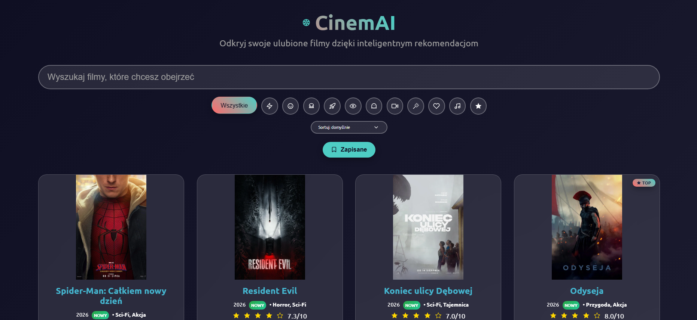
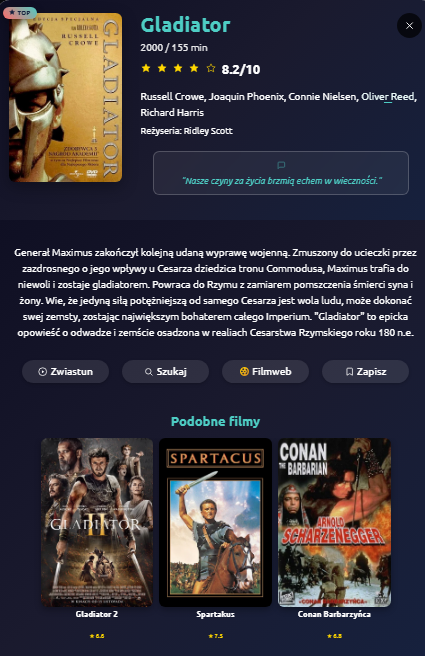

PL 
# CinemAI
Znajdź filmy, które Ciebie interesują. Aplikacja webowa w języku polskim do wyszukiwania i zarządzania filmami z wykorzystaniem API The Movie Database (TMDb). Zbudowana w czystym HTML, CSS i JavaScript bez zewnętrznych frameworków. 

<p align="center">
  
  
</p>

## Inteligentne Wyszukiwanie. Filtrowanie, Sortowanie i Zapisywanie Filmów
Wyszukiwanie podstawowe i zaawansowane - po tytule, aktorach, reżyserach, roku i gatunku (np. "komedia 2020") <br />
Filtrowanie po gatunkach filmowych oraz filtr TOP dla najwyżej ocenianych filmów <br />
Sortowanie wyników - według oceny, nazwy A-Z, daty premiery i długości filmu <br />
Dodawanie i przeglądanie zapisanych filmów <br />
Debouncing - optymalizacja zapytań API <br />

## Informacje o konkretnym filmie
Plakaty filmów w wysokiej rozdzielczości <br />
Oceny użytkowników i system gwiazdek <br />
Obsada i reżyser - kliknięcie nazwiska wyszukuje pozostałe filmy tej osoby <br />
Zwiastun odtwarzany bezpośrednio w oknie filmu <br />
Podobne filmy - karuzela propozycji dobieranych na podstawie gatunku <br />
Linki do Filmweb i Google (do szybkiego wyszukiwania) <br />
Plakietka NOWY przy filmach z ostatnich 6 miesięcy <br /> 
Plakietka TOP przy filmach z oceną 7.9 i wyżej <br />

## Prosty Interfejs Użytkownika
Responsywny design <br />
Modalne okna - szczegółowe informacje o filmach <br />
Paginacja - sprawne przeglądanie wyników <br />

## Technologie
Frontend: HTML5, CSS3, JavaScript (ES6+) <br />
API: The Movie Database (TMDb) <br />
Lokalny Storage: Zapisywanie ulubionych filmów <br />

## Instalacja
1. Sklonuj repozytorium <br />
2. Uzyskaj klucz API TMDb <br />
3. Stwórz plik `config.js` w katalogu głównym projektu <br />

Plik `config.js` przeznaczony jest do przechowywania klucza API TMDb. **Ten plik NIE jest dodawany do repozytorium - znajduje się w .gitignore**.

```js
// config.js
const CONFIG = {
    TMDB_API_KEY: 'TWOJ_KLUCZ'
};
```

4. Uruchom aplikację - otwórz `index.html` w przeglądarce <br />

<br />

🇬🇧 
# CinemAI
Find movies that interest you. A Polish-language web application for searching and managing movies using The Movie Database (TMDb) API. Built with pure HTML, CSS, and JavaScript without external frameworks.

## Smart Search. Filtering, Sorting and Saving Movies
Basic and advanced search - by title, actors, directors, year and genre (e.g. "komedia 2020") <br />
Filter by movie genres and a TOP filter for the highest-rated movies <br />
Result sorting - by rating, name A-Z, release date and movie length <br />
Add and browse saved movies <br />
Debouncing - API query optimization <br />

## Specific Movie Information
High-resolution movie posters <br />
User ratings and star system <br />
Cast and director - clicking a name searches for that person's other movies <br />
Trailer played right inside the movie window <br />
Similar movies - a carousel of suggestions picked by genre <br />
Links to Filmweb and Google (for quick searching) <br />
"NEW" badge for movies released in the last 6 months <br />
"TOP" badge for movies rated 7.9 and above <br />

## Simple User Interface
Responsive design <br />
Modal windows - detailed movie information <br />
Pagination - efficient result browsing <br />

## Technologies
Frontend: HTML5, CSS3, JavaScript (ES6+) <br />
API: The Movie Database (TMDb) <br />
Local Storage: Saving favorite movies <br />

## Installation
1. Clone the repository <br />
2. Get a TMDb API key <br />
3. Create a `config.js` file in the project root <br />

The `config.js` file is designed to store the TMDb API key. **This file is NOT added to the repository - it's included in .gitignore**.

```js
// config.js
const CONFIG = {
    TMDB_API_KEY: 'YOUR_KEY'
};
```

4. Run the application - open `index.html` in a browser <br />

<br />
LIVE DEMO: https://krzykerlin.github.io/CinemAI/